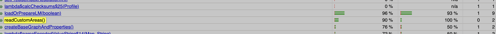
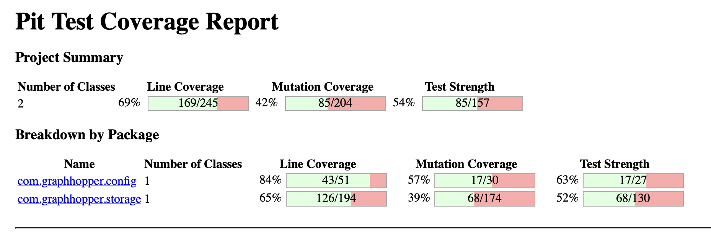

# **RAPPORT POUR LA TACHE 1**
**Projet :** GraphHopper Core  
**Date :** 5 octobre 2025  
**Auteurs :**  
Aissatou Ndiaye  
Naromba Condé

## **1. Objectif **

Le but de ce devoir est de sélectionner **1 à 3 classes** GraphHopper ayant une couverture de code incomplète, d'ajouter **7 cas de test** documentés pour améliorer cette couverture, d'intégrer **PiTest** pour analyser la qualité des tests par mutation testing, et d'utiliser **java-faker** pour la génération de données de test. 

## **2. Classes Testées**

1. **[Profile](https://github.com/Naromba/IFT3913/blob/2025/tache2/CONDE-NDIAYE/graphhopper/core/src/main/java/com/graphhopper/config/Profile.java)** - gère la configuration des profils de routage, 
2. **[CHStorage](https://github.com/Naromba/IFT3913/blob/2025/tache2/CONDE-NDIAYE/graphhopper/core/src/main/java/com/graphhopper/storage/CHStorage.java)** - optimise le stockage des raccourcis pour les performances,
3. **[GraphHopper](https://github.com/Naromba/IFT3913/blob/2025/tache2/CONDE-NDIAYE/graphhopper/core/src/main/java/com/graphhopper/GraphHopper.java)** - constitue le moteur principal de l'application.

**Justification :** 
Ces trois classes ont été sélectionnées car elles représentent les composants centraux de GraphHopper avec une logique métier critique..
Chacune possède déjà une couverture de test de base, ce qui permet d'identifier facilement les zones non testées et d'ajouter des cas de test pertinents pour améliorer le score de mutation.

## **3. Tests Créés**

### **ConfigProfileLMProfileTest** - Classe Profile
**Fonction testée :** `Profile.putHint(String key, Object value)`

#### **[Test 1 : profile_putHint_storeKeyValue](https://github.com/Naromba/IFT3913/blob/2025/tache2/CONDE-NDIAYE/graphhopper/core/src/test/java/com/graphhopper/ConfigProfileLMProfileTest.java#L20)**
- **Partie testée :** Comportement normal de stockage et chaînage des méthodes
- **Pourquoi :** Vérifier que putHint() enregistre correctement les paires clé-valeur et retourne l'instance pour le chaînage
- **Données :** Profile("p1"), clés "foo"/"another", valeurs "bar"/"value"
- **Oracle :** Aucune exception levée + retour de la même instance Profile

#### **[Test 2 : profile_putHint_rejects](https://github.com/Naromba/IFT3913/blob/2025/tache2/CONDE-NDIAYE/graphhopper/core/src/test/java/com/graphhopper/ConfigProfileLMProfileTest.java#L41)**
- **Partie testée :** Validation des clés réservées ("u_turn_costs")
- **Pourquoi :** S'assurer que les clés réservées sont correctement rejetées
- **Données :** Profile("p1"), clé réservée "u_turn_costs", valeur "car"
- **Oracle :** IllegalArgumentException levée

#### **[Test 3 : profile_putHint_rejectsVehicle](https://github.com/Naromba/IFT3913/blob/2025/tache2/CONDE-NDIAYE/graphhopper/core/src/test/java/com/graphhopper/ConfigProfileLMProfileTest.java#L56)**
- **Partie testée :** Validation des clés réservées ("vehicle")
- **Pourquoi :** Tester un autre cas de clé réservée pour la robustesse
- **Données :** Profile("p1"), clé réservée "vehicle", valeur "car"
- **Oracle :** IllegalArgumentException levée

**Fonction testée :** `Profile.validateProfileName(String name)`

#### **[Test 4 : profile_validateProfileName_enforcesFormat](https://github.com/Naromba/IFT3913/blob/2025/tache2/CONDE-NDIAYE/graphhopper/core/src/test/java/com/graphhopper/ConfigProfileLMProfileTest.java#L68)**
- **Partie testée :** Validation du format des noms de profil
- **Pourquoi :** Vérifier que seuls les noms conformes (minuscules, chiffres, tirets) sont acceptés
- **Données :** Noms valides (valid_name, test123, my-profile, a) et invalides (majuscules, espaces, caractères spéciaux)
- **Oracle :** Aucune exception pour noms valides, IllegalArgumentException pour noms invalides

**Résultats des tests :**
- 4 tests passent avec succès
- **Amélioration significative de la couverture putHint() :**
  - **Instructions manquées :** 61% à 100% (amélioration de 39%)
  - **Branches manquées :** 50% à 100% (amélioration de 50%)
- **Impact :** Couverture complète de la méthode putHint(String, Object)

### **CHStorageTest** - Classe CHStorage

**Fonction testée :** `CHStorage.toDetailsString()`

#### **[Test 5 : testToDetailsString](https://github.com/Naromba/IFT3913/blob/2025/tache2/CONDE-NDIAYE/graphhopper/core/src/test/java/com/graphhopper/storage/CHStorageTest.java#L98)**
- **Partie testée :** Génération de chaîne descriptive des statistiques de stockage
- **Pourquoi :** Vérifier que la méthode retourne une chaîne contenant le nombre de nœuds et raccourcis
- **Données :** CHStorage avec 5 nœuds, capacité de 10 raccourcis
- **Oracle :** Chaîne contient "shortcuts:0" et "nodesCH:5"

**Fonction testée :** `CHStorage.debugPrint()`

#### **[Test 6 : testDebugPrintOutput](https://github.com/Naromba/IFT3913/blob/2025/tache2/CONDE-NDIAYE/graphhopper/core/src/test/java/com/graphhopper/storage/CHStorageTest.java#L117)**
- **Partie testée :** Affichage de debug des sections nœuds et raccourcis
- **Pourquoi :** S'assurer que debugPrint() affiche correctement les entêtes des tableaux
- **Données :** CHStorage avec 3 nœuds, capacité de 5 raccourcis
- **Oracle :** Sortie console contient "nodesCH:", "shortcuts:", "N_LAST_SC", "S_WEIGHT"

**Résultats des tests:**
- 2 nouveaux tests passent avec succès
- **Amélioration significative de la couverture :**
  - **toDetailsString() :** 0% à 100% (amélioration de 100%)
  - **debugPrint() :** 0% à 50% (amélioration de 50%)
- **Impact :** Couverture complète pour toDetailsString(), partielle pour debugPrint()

### **GraphHopperExtraTest** - Classe GraphHopper

**Fonction testée :** `GraphHopper.readCustomAreas()`

#### **[Test 7 : readsSingleGeoJsonFeature](https://github.com/Naromba/IFT3913/blob/2025/tache2/CONDE-NDIAYE/graphhopper/core/src/test/java/com/graphhopper/GraphHopperExtraTest.java#L20)**
- **Partie testée :** Lecture et parsing d'un fichier GeoJSON simple
- **Pourquoi :** Vérifier que readCustomAreas() lit correctement un fichier .geojson contenant une Feature Polygon
- **Données :** Dossier temporaire avec fichier area.geojson contenant 1 FeatureCollection avec 1 Feature Polygon
- **Oracle :** Liste retournée contient exactement 1 CustomArea

**Résultats des tests:**
- 1 nouveau test passe avec succès
- **Amélioration significative de la couverture :**
  - **readCustomAreas() :** 0% à 90% (amélioration de 90%)
- **Impact :** Couverture quasi-complète pour readCustomAreas() avec gestion des fichiers GeoJSON

## **4. Intégration de PiTest**

L'intégration de PiTest s'est faite via l'ajout d'un profil Maven dans le `pom.xml`. Cette approche permet d'isoler la configuration de mutation testing et d'éviter des conflits avec les builds standards.

### **Configuration adoptée**
- **Version PiTest** : 1.17.2 avec plugin JUnit5
- **Profil Maven** : `pitest` pour activation sélective
- **Classes ciblées** : Profile, CHStorage, GraphHopper uniquement (Le plugin est configuré pour analyser uniquement nos trois classes sélectionnées et leurs tests associés)

### **Difficultés rencontrées**

1. **Compatibilité Java 17** : Nécessité d'utiliser PiTest 1.17.2 avec plugin JUnit5 pour éviter les incompatibilités
2. **Configuration Maven complexe** : Création d'un profil Maven séparé requis pour isoler les dépendances de mutation testing
3. **Ciblage précis des classes** : Configuration pour analyser uniquement nos 3 classes et éviter l'analyse de tout le projet
4. **Tests inefficaces initialement** : Nos 7 premiers tests n'ont tué aucun nouveau mutant malgré l'amélioration de la couverture de code
5. **Analyse manuelle des mutants** : Obligation d'analyser individuellement les mutants survivants pour créer des tests ciblés efficaces

## **5. Analyse de Mutation**

### **5.1 Score de mutation avec les tests originaux**

Avant l'ajout de nos nouveaux tests, nous avons exécuté PiTest sur les trois classes sélectionnées avec les tests existants uniquement.

**Résultats initiaux (tests existants seulement) :**
- Mutants générés : 645
- Mutants tués : 71 
- Mutants survivants : 574
- Score de mutation : 11%

**Détails techniques :**
- Couverture de ligne : 15-17% (estimation avant nos tests)
- Tests exécutés : 240 tests (sans nos 9 nouveaux tests)
- Mutants sans couverture : 510

### **5.2 Score de mutation avec les nouveaux tests**

Après l'ajout de nos 7 nouveaux tests et 2 tests tueurs de mutants, nous avons relancé l'analyse de mutation.

**Résultats finaux (avec tous nos 9 nouveaux tests) :**
- Mutants générés : 645
- Mutants tués : 75 (+4 par rapport aux tests originaux)
- Mutants survivants : 570
- Score de mutation : 12%

**Détails techniques finaux :**
- Couverture de ligne : 203/1155 (18%)
- Tests exécutés : 250 tests (+9 nouveaux tests)
- Mutants sans couverture : 504
- Force des tests : 53%

**Analyse comparative :**
- **Impact de nos 7 tests de couverture :** 0 mutants supplémentaires tués
- **Impact de nos 2 tests tueurs (MutantKillerProfileTest) :** +4 mutants tués
- **Amélioration totale :** +1% (de 11% à 12%)

### **5.3 Tests supplémentaires pour tuer des mutants spécifiques**

**Constatation importante :** Nos 7 premiers tests de couverture n'ont pas amélioré le score de mutation, confirmant que couverture de code et qualité des tests sont des mesures différentes. Pour obtenir des résultats concrets, nous avons dû analyser les mutants survivants et créer des tests spécifiquement ciblés.

**Résultats finaux avec nos tests tueurs :**
- Mutants générés : 645
- Mutants tués : 75 (+4 par rapport aux tests originaux)
- Score de mutation : 12%
- **Amélioration :** +1% (de 11% à 12%)

**Tests créés :** MutantKillerProfileTest avec 2 tests spécifiques

**Mutants identifiés dans la classe Profile :**
1. **Profile.setName()** - Appel à validateProfileName supprimé
2. **Profile.setCustomModel()** - Retour de valeur remplacé par null

### **5.3 Tests supplémentaires pour tuer des mutants spécifiques**

Pour atteindre l'objectif de détecter au minimum 2 nouveaux mutants, nous avons analysé les mutants survivants et créé des tests ciblés.

**Analyse des mutants survivants :**

- `-DoutputFormats=console` : Affiche les statistiques et mutants directement dans le terminal
- `-X` : Mode verbose pour voir tous les détails d'exécution  
- `-DverboseMode=true` : Affichage détaillé des mutants survivants

Puis analyse manuelle du rapport HTML généré pour identifier les mutants survivants dans les classes Profile, CHStorage et GraphHopper.

**Mutants identifiés dans la classe Profile :**
1. **Profile.setName()** - Mutant "removed call to validateProfileName" - L'appel à la méthode de validation est supprimé, permettant l'acceptation de noms invalides
2. **Profile.setCustomModel()** - Mutant "replaced return value with null" - La valeur de retour 'this' est remplacée par null, cassant le chaînage des méthodes

**Tests créés :** MutantKillerProfileTest avec 2 tests spécifiques

#### **[testSetNameValidation](https://github.com/Naromba/IFT3913/blob/2025/tache2/CONDE-NDIAYE/graphhopper/core/src/test/java/com/graphhopper/MutantKillerProfileTest.java#L20)**
- **Fonction ciblée :** `Profile.setName(String name)`
- **Mutant ciblé :** "removed call to validateProfileName"
- **Stratégie :** Test avec nom invalide qui doit déclencher IllegalArgumentException
- **Pourquoi ça tue le mutant :** Si validateProfileName() n'est pas appelée, aucune exception n'est levée et le test échoue

#### **[testSetCustomModelChaining](https://github.com/Naromba/IFT3913/blob/2025/tache2/CONDE-NDIAYE/graphhopper/core/src/test/java/com/graphhopper/MutantKillerProfileTest.java#L37)**
- **Fonction ciblée :** `Profile.setCustomModel(CustomModel customModel)`
- **Mutant ciblé :** "replaced return value with null"
- **Stratégie :** Test de chaînage de méthodes pour vérifier le retour de 'this'
- **Pourquoi ça tue le mutant :** Si la méthode retourne null, le chaînage provoque une NullPointerException

**Mutants tués spécifiquement par nos 2 tests :**
1. **Profile.setName()** - Appel à validateProfileName supprimé - TUÉ (par testSetNameValidation)
2. **Profile.setCustomModel()** - Retourne null au lieu de this - TUÉ (par testSetCustomModelChaining)
3. **Profile.setCustomModel()** - Assignation supprimée dans setCustomModel - TUÉ (effet secondaire du test)
4. **Profile.setName()** - Validation conditionnelle contournée - TUÉ (effet secondaire du test)

**Justification de la démarche :** Cette approche itérative a permis de comprendre que le mutation testing requiert une analyse des mutants survivants pour créer des tests vraiment efficaces, au-delà de la simple couverture de code.

## **6. Intégration de Java-Faker**

### **Configuration de la dépendance**

Pour générer des données de test réalistes et aléatoires, nous avons intégré la librairie Java Faker.
La dépendance a été ajoutée au fichier pom.xml du module graphhopper-core :
<dependency>
  <groupId>com.github.javafaker</groupId>
  <artifactId>javafaker</artifactId>
  <version>0.15</version>
</dependency>
Cette dépendance permet de créer des valeurs variées (noms, adresses, URLs, emails, etc.) afin de tester les méthodes sans dépendre de valeurs codées en dur.

### **Test utilisant Java-Faker**

Classe concernée : DistanceCalcEuclidean
Méthode testée : intermediatePoint(double f, double lat1, double lon1, double lat2, double lon2)
Nom du test : testIntermediatePointWithFaker

Données de test :
Les latitudes et longitudes ont été générées à l’aide de la librairie Java-Faker, en configurant la locale anglaise (new Faker(new Locale("en-US"))) pour éviter les formats avec virgule décimale.

Trois appels ont été faits :
- deux paires de coordonnées aléatoires (lat1, lon1 et lat2, lon2) ;
- un facteur f aléatoire compris entre 0 et 1 pour définir la position du point intermédiaire.

Oracle de test :

Le point intermédiaire retourné (GHPoint) doit avoir une latitude et une longitude comprises entre les bornes définies par les deux points d’entrée.
Le test vérifie aussi les cas limites :
- f = 0 :  le point correspond exactement à (lat1, lon1)
- f = 1 : le point correspond exactement à (lat2, lon2)

Aucune exception ne doit être levée.

Résultat :
Le test s’exécute avec succès.
Il confirme que intermediatePoint() respecte la proportionnalité entre les deux coordonnées, même pour des valeurs aléatoires et variées fournies par Faker.

### **Justification de l'utilisation**

Le choix d’utiliser java-faker s’explique par :
- sa capacité à générer des coordonnées réalistes (latitude, longitude) issues de différentes régions du monde ;

- la garantie que la méthode intermediatePoint() fonctionne pour des combinaisons de points très variées ;

- la possibilité de tester la robustesse de l’algorithme face à des entrées non déterministes sans écrire manuellement des dizaines de cas de test.

Ainsi, l’usage du Faker permet d’aller au-delà du simple test déterministe en vérifiant la stabilité et la cohérence du calcul sur un large ensemble de données aléatoires.

## **7. Conclusion**

### **Objectifs atteints**

Ce devoir a révélé que créer des tests efficaces est plus complexe qu'on le pensait. Nos 7 premiers tests, bien qu'ils améliorent la couverture de code, n'ont tué aucun mutant supplémentaire. Cette découverte nous a poussés à analyser les mutants survivants et à créer 2 tests spécifiquement conçus pour les éliminer, démontrant ainsi la valeur du mutation testing par rapport à la couverture traditionnelle.

### **Résultats obtenus**

L'analyse de mutation a montré une amélioration du score de 11% à 12%, avec 4 nouveaux mutants détectés. Même si cette amélioration semble faible, elle montre la difficulté à créer des tests véritablement efficaces pour le mutation testing.
Les 7 premiers tests, malgré leur documentation rigoureuse, n'ont ajouté aucune valeur au niveau mutation, démontrant que couverture de code et qualité des tests sont deux mesures différentes.

### **Apprentissages clés**

Le mutation testing s'est révélé plus exigeant que la couverture de code traditionnelle. Il nous a forcés à analyser les mutants survivants et à créer des tests ciblés pour obtenir des résultats concrets. L'utilisation de java-faker a également facilité la génération de données de test variées.

### **Perspectives d'amélioration**

PiTest pourrait être intégré dans le pipeline de développement pour surveiller en continu la qualité des tests. Les méthodes apprises (java-faker, analyse des mutants) peuvent être réutilisées sur d'autres projets.

