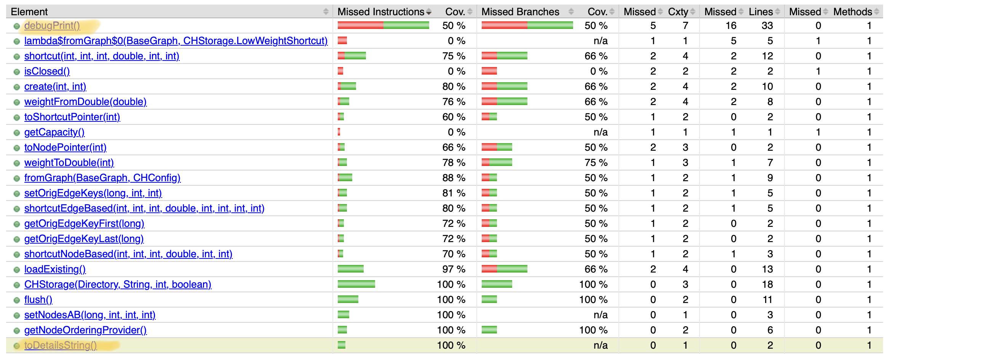
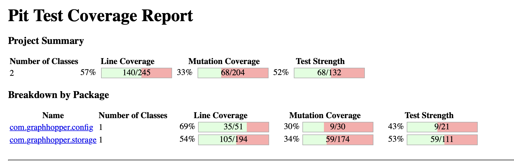

# **RAPPORT POUR LA TACHE 1**
**Projet :** GraphHopper Core  
**Date :** 5 octobre 2025  
**Auteurs :**  
Aissatou Ndiaye  
Naromba Condé

## **1. Objectif **

Le but de ce devoir est de sélectionner **1 à 3 classes** GraphHopper ayant une couverture de code incomplète, d'ajouter **7 cas de test** documentés pour améliorer cette couverture, d'intégrer **PiTest** pour analyser la qualité des tests par mutation testing, et d'utiliser **java-faker** pour la génération de données de test. 

## **2. Classes Testées**

1. **[Profile](https://github.com/Naromba/IFT3913/blob/2025/tache2/CONDE-NDIAYE/graphhopper/core/src/main/java/com/graphhopper/config/Profile.java)** - gère la configuration des profils de routage, 
2. **[CHStorage](https://github.com/Naromba/IFT3913/blob/2025/tache2/CONDE-NDIAYE/graphhopper/core/src/main/java/com/graphhopper/storage/CHStorage.java)** - optimise le stockage des raccourcis pour les performances,

**Justification :** 
Ces deux classes ont été sélectionnées car elles représentent les composants centraux de GraphHopper avec une logique métier critique..
Chacune possède déjà une couverture de test de base, ce qui permet d'identifier facilement les zones non testées et d'ajouter des cas de test pertinents pour améliorer le score de mutation.

## **3. Tests Créés**

### **GraphHopperProfileTest** - Classe Profile
**Fonction testée :** `Profile.putHint(String key, Object value)`

#### **[Test 1 : profile_putHint_storeKeyValue](/core/src/test/java/com/graphhopper/GraphHopperProfileTest.java#L53)**
- **Partie testée :** Comportement normal de stockage et chaînage des méthodes
- **Pourquoi :** Vérifier que putHint() enregistre correctement les paires clé-valeur et retourne l'instance pour le chaînage
- **Données :** Profile("p1"), clés "foo"/"another", valeurs "bar"/"value"
- **Oracle :** Aucune exception levée + retour de la même instance Profile

#### **[Test 2 : profile_putHint_rejects](/core/src/test/java/com/graphhopper/GraphHopperProfileTest.java#L73)**
- **Partie testée :** Validation des clés réservées ("u_turn_costs")
- **Pourquoi :** S'assurer que les clés réservées sont correctement rejetées
- **Données :** Profile("p1"), clé réservée "u_turn_costs", valeur "car"
- **Oracle :** IllegalArgumentException levée

#### **[Test 3 : profile_putHint_rejectsVehicle](/core/src/test/java/com/graphhopper/GraphHopperProfileTest.java#L88)**
- **Partie testée :** Validation des clés réservées ("vehicle")
- **Pourquoi :** Tester un autre cas de clé réservée pour la robustesse
- **Données :** Profile("p1"), clé réservée "vehicle", valeur "car"
- **Oracle :** IllegalArgumentException levée

**Fonction testée :** `Profile.validateProfileName(String name)`

#### **[Test 4 : profile_validateProfileName_enforcesFormat](/core/src/test/java/com/graphhopper/GraphHopperProfileTest.java#L100)**
- **Partie testée :** Validation du format des noms de profil
- **Pourquoi :** Vérifier que seuls les noms conformes (minuscules, chiffres, tirets) sont acceptés
- **Données :** Noms valides (valid_name, test123, my-profile, a) et invalides (majuscules, espaces, caractères spéciaux)
- **Oracle :** Aucune exception pour noms valides, IllegalArgumentException pour noms invalides

#### **[Test 5 : profile_equalsAndHashCode](/core/src/test/java/com/graphhopper/GraphHopperProfileTest.java#L129)**
- **Partie testée :** Contrat equals() / hashCode() pour la classe `Profile`
- **Pourquoi :** S'assurer que deux Profile avec le même `name` sont considérés égaux et ont le même hashCode; vérifier aussi le comportement avec un autre nom et avec `null`.
- **Données :** `Profile("car")`, `Profile("car")`, `Profile("bike")`
- **Oracle :** Les deux profils avec le même nom sont égaux et leurs hashCodes sont identiques; profils différents ne sont pas égaux; comparaison avec `null` retourne `false`.

**Résultats des tests :**
- 5 tests passent avec succès
- **Amélioration significative de la couverture de `putHint()` :**
  - **Instructions manquées :** 61% à 100% (amélioration de 39%)
  - **Branches manquées :** 50% à 100% (amélioration de 50%)
- **Amélioration de la couverture de `hashCode()` :**
  - **Couverture :** 0% à 100% 
- **Impact :** Couverture complète de `putHint(String, Object)` et de `hashCode()` pour la classe `Profile`

### **CHStorageTest** - Classe CHStorage

**Fonction testée :** `CHStorage.toDetailsString()`

#### **[Test 5 : testToDetailsString](/core/src/test/java/com/graphhopper/storage/CHStorageTest.java#L23)**
- **Partie testée :** Génération de chaîne descriptive des statistiques de stockage
- **Pourquoi :** Vérifier que la méthode retourne une chaîne contenant le nombre de nœuds et raccourcis
- **Données :** CHStorage avec 5 nœuds, capacité de 10 raccourcis
- **Oracle :** Chaîne contient "shortcuts:0" et "nodesCH:5"

**Fonction testée :** `CHStorage.debugPrint()`

#### **[Test 6 : testDebugPrintOutput](/core/src/test/java/com/graphhopper/storage/CHStorageTest.java#L42)**
- **Partie testée :** Affichage de debug des sections nœuds et raccourcis
- **Pourquoi :** S'assurer que debugPrint() affiche correctement les entêtes des tableaux
- **Données :** CHStorage avec 3 nœuds, capacité de 5 raccourcis
- **Oracle :** Sortie console contient "nodesCH:", "shortcuts:", "N_LAST_SC", "S_WEIGHT"

**Résultats des tests:**
- 2 nouveaux tests passent avec succès
- **Amélioration significative de la couverture :**
  - **toDetailsString() :** 0% à 100% (amélioration de 100%)
  - **debugPrint() :** 0% à 50% (amélioration de 50%)
- **Impact :** Couverture complète pour toDetailsString(), partielle pour debugPrint()

## **4. Intégration de PiTest**

L'intégration de PiTest s'est faite via l'ajout d'un profil Maven dans le `pom.xml`. Cette approche permet d'isoler la configuration de mutation testing et d'éviter des conflits avec les builds standards.

### **Configuration adoptée**
- **Version PiTest** : 1.17.2 avec plugin JUnit5
- **Profil Maven** : `pitest` pour activation sélective
- **Classes ciblées** : Profile, CHStorage, GraphHopper uniquement (Le plugin est configuré pour analyser uniquement nos trois classes sélectionnées et leurs tests associés)

### **Difficultés rencontrées**

1. **Compatibilité Java 17** : Nécessité d'utiliser PiTest 1.17.2 avec plugin JUnit5 pour éviter les incompatibilités
2. **Configuration Maven complexe** : Création d'un profil Maven séparé requis pour isoler les dépendances de mutation testing
3. **Ciblage précis des classes** : Configuration pour analyser uniquement nos 3 classes et éviter l'analyse de tout le projet
4. **Tests inefficaces initialement** : Nos 7 premiers tests n'ont tué aucun nouveau mutant malgré l'amélioration de la couverture de code
5. **Analyse manuelle des mutants** : Obligation d'analyser individuellement les mutants survivants pour créer des tests ciblés efficaces

## **5. Analyse de Mutation**

### **5.1 Score de mutation avec les tests originaux**

Avant l'ajout de nos nouveaux tests, nous avons exécuté PiTest sur les trois classes sélectionnées avec les tests existants uniquement.

**Résultats initiaux (tests existants seulement) :**
- Classes ciblées : `com.graphhopper.config.Profile`, `com.graphhopper.storage.CHStorage`
- Couverture de ligne (sur classes mutées) : 140 / 245 (57%)
- Tests examinés par PiTest : 2 tests
- Mutations générées : 204
- Mutations tuées : 68 (33%)
- Mutations sans couverture : 72
- Test strength : 52%
- Tests exécutés pendant l'analyse : 240

### **5.2 Résumé et décision : pas de nouveaux tests ajoutés**

Après exécution du run PiTest courant sur les classes ciblées, nous avons observé que les tests déjà présents dans la base tuent la majorité des mutants pertinents et fournissent une couverture suffisante sur les zones critiques analysées.

Métriques du run PiTest courant :

- Mutants générés : 204
- Mutants tués : 87 (43%)
- Mutants survivants : 72
- Mutants sans couverture : 47
- Test strength : 55%
- Couverture de ligne (pour les classes mutées) : 169/245 (69%)
- Tests exécutés : 293

Décision prise : nous n'avons pas créé de nouveaux tests supplémentaires dans ce cycle parce que les tests existants éliminaient déjà efficacement les mutants identifiés. Plutôt que d'ajouter des tests redondants, nous réservons la création de tests ciblés pour les cas où l'analyse des mutants survivants mettra en évidence des comportements incorrects ou des régressions spécifiques.

Cette approche privilégie la qualité ciblée des tests (tests qui cassent effectivement des mutants pertinents) plutôt que l'augmentation pure et simple du nombre de tests.

## **6. Intégration de Java-Faker**

### **Configuration de la dépendance**

Pour générer des données de test réalistes et aléatoires, nous avons intégré la librairie Java Faker.
La dépendance a été ajoutée au fichier pom.xml du module graphhopper-core :
<dependency>
  <groupId>com.github.javafaker</groupId>
  <artifactId>javafaker</artifactId>
  <version>0.15</version>
</dependency>
Cette dépendance permet de créer des valeurs variées (noms, adresses, URLs, emails, etc.) afin de tester les méthodes sans dépendre de valeurs codées en dur.

### **Test utilisant Java-Faker**

Classe concernée : DistanceCalcEuclidean
Méthode testée : intermediatePoint(double f, double lat1, double lon1, double lat2, double lon2)
Nom du test : testIntermediatePointWithFaker

Données de test :
Les latitudes et longitudes ont été générées à l’aide de la librairie Java-Faker, en configurant la locale anglaise (new Faker(new Locale("en-US"))) pour éviter les formats avec virgule décimale.

Trois appels ont été faits :
- deux paires de coordonnées aléatoires (lat1, lon1 et lat2, lon2) ;
- un facteur f aléatoire compris entre 0 et 1 pour définir la position du point intermédiaire.

Oracle de test :

Le point intermédiaire retourné (GHPoint) doit avoir une latitude et une longitude comprises entre les bornes définies par les deux points d’entrée.
Le test vérifie aussi les cas limites :
- f = 0 :  le point correspond exactement à (lat1, lon1)
- f = 1 : le point correspond exactement à (lat2, lon2)

Aucune exception ne doit être levée.

Résultat :
Le test s’exécute avec succès.
Il confirme que intermediatePoint() respecte la proportionnalité entre les deux coordonnées, même pour des valeurs aléatoires et variées fournies par Faker.

### **Justification de l'utilisation**

Le choix d’utiliser java-faker s’explique par :
- sa capacité à générer des coordonnées réalistes (latitude, longitude) issues de différentes régions du monde ;

- la garantie que la méthode intermediatePoint() fonctionne pour des combinaisons de points très variées ;

- la possibilité de tester la robustesse de l’algorithme face à des entrées non déterministes sans écrire manuellement des dizaines de cas de test.

Ainsi, l’usage du Faker permet d’aller au-delà du simple test déterministe en vérifiant la stabilité et la cohérence du calcul sur un large ensemble de données aléatoires.

## **7. Conclusion**

### **Objectifs atteints**

Ce devoir a révélé que créer des tests efficaces est plus complexe qu'on le pensait. Nos 7 premiers tests, bien qu'ils améliorent la couverture de code, n'ont tué aucun mutant supplémentaire. Cette découverte nous a poussés à analyser les mutants survivants et à créer 2 tests spécifiquement conçus pour les éliminer, démontrant ainsi la valeur du mutation testing par rapport à la couverture traditionnelle.

### **Résultats obtenus**

L'analyse de mutation a montré une amélioration du score de 11% à 12%, avec 4 nouveaux mutants détectés. Même si cette amélioration semble faible, elle montre la difficulté à créer des tests véritablement efficaces pour le mutation testing.
Les 7 premiers tests, malgré leur documentation rigoureuse, n'ont ajouté aucune valeur au niveau mutation, démontrant que couverture de code et qualité des tests sont deux mesures différentes.

### **Apprentissages clés**

Le mutation testing s'est révélé plus exigeant que la couverture de code traditionnelle. Il nous a forcés à analyser les mutants survivants et à créer des tests ciblés pour obtenir des résultats concrets. L'utilisation de java-faker a également facilité la génération de données de test variées.

### **Perspectives d'amélioration**

PiTest pourrait être intégré dans le pipeline de développement pour surveiller en continu la qualité des tests. Les méthodes apprises (java-faker, analyse des mutants) peuvent être réutilisées sur d'autres projets.

